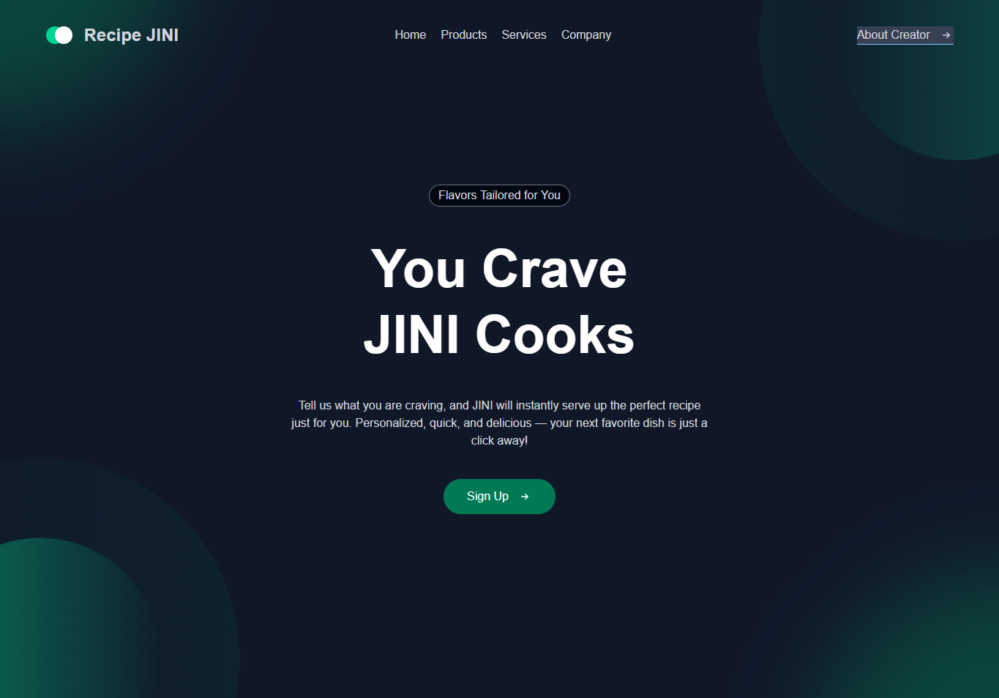
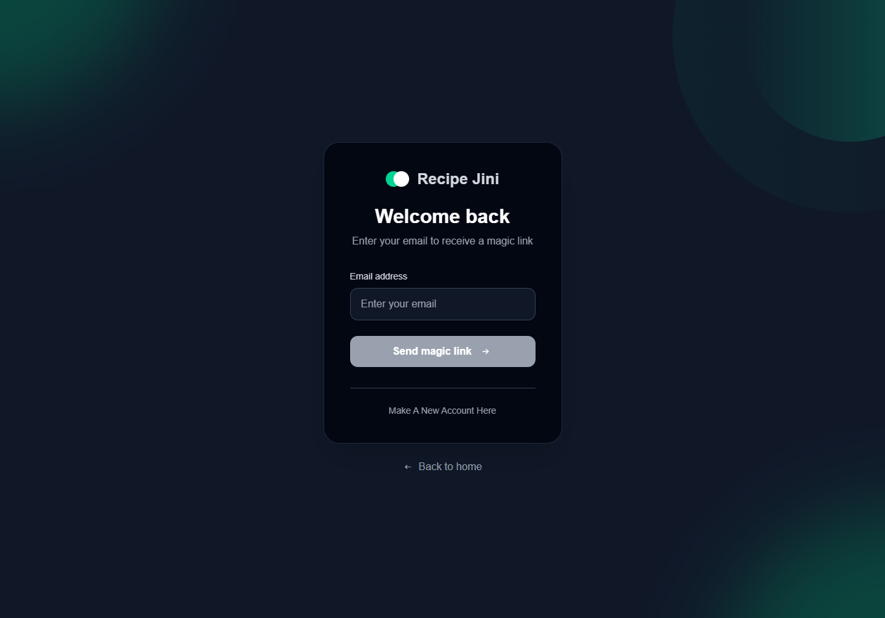
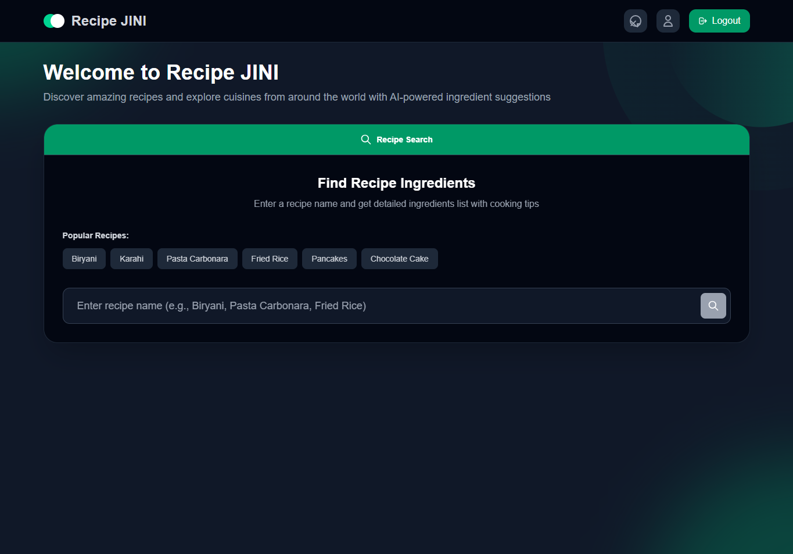
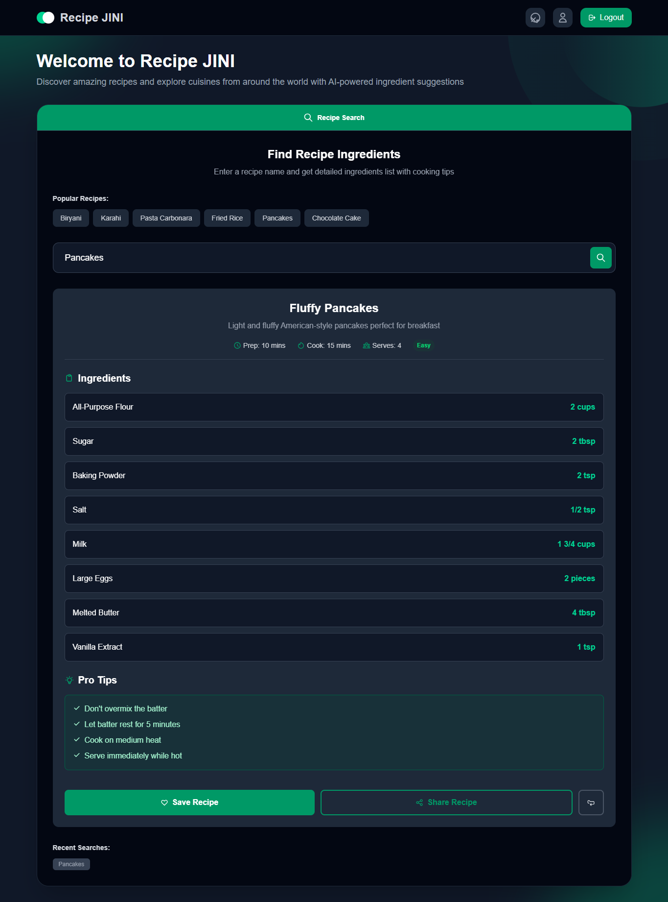

# Recipe Generator - Next.js Application



# Overview

A modern recipe generator built with Next.js, offering a clean and intuitive interface to explore recipes across various categories and cuisines. Users can sign up effortlessly using our Magic Link — simply enter your email and click the link sent to your inbox to create your account. Once logged in, you can search for a wide range of food items and instantly receive detailed recipes tailored to your query. The app keeps a history of your past searches and allows multiple recipe lookups. You can log out at any time with a single click.


## Video Demo

- For better understanding of the overall system, have a look at the attached demo for the project.

<p align="center">
  
</p>


## Features

- 📱 **Responsive Design** - Web-first approach with Tailwind CSS
- 🍳 **Recipe Categories** - Browse recipes by categories (breakfast, lunch, dinner, etc.)
- 🌎 **Multiple Cuisines** - Explore recipes from different cuisines
- ⚡ **Modern Stack** - Built with Next.js App Router
- 🔍 **Filter System** - Filter recipes by category and cuisine

## Tech Stack

- **Frontend**: Next.js 13+, React 18
- **Styling**: Tailwind CSS
- **UI Components**: Custom components
- **Icons**: Lucide React
- **Authentication + Magic Link**: Appwrite
- **Deployment**: Vercel Pipelining

## Prerequisites

Before running this application, make sure you have:

- Node.js 16+ installed
- npm package manager


## Installation Steps

### 1. Clone and Install Dependencies

```bash
# Clone the repository
git clone https://github.com/SanaUllah04/Recipe-Generator.git
cd Recipe-Generator

# Install dependencies
npm install
```

### 2. Run the Development Server

```bash
npm run dev
```

The application will be available at `http://localhost:3000`.


## Working

#### 1. Click on SignUp.


#### 2. Enter You Email.


#### 3. You Will be verified by **AppWrite** and arrive on the Search Screen


#### 4. Search Your favourite meal to recieve your Recipe.
